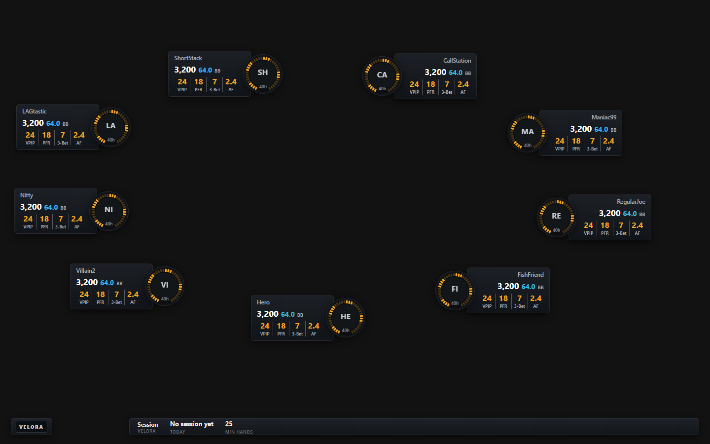

# Velora Poker

A Windows desktop HUD (heads-up display) for PokerStars. Velora watches your hand-history folder, parses every new hand into a local SQLite database, computes per-opponent statistics and draws them on a transparent, always-on-top overlay that sits on each open table and follows it as you move it.

Built with **Tauri 2 (Rust)** and **React 19 + TypeScript**. Everything runs on your machine: no accounts, no cloud, no telemetry, no network calls.



## Features

- **Live import.** A filesystem watcher picks up new PokerStars hand histories (cash, tournaments, Zoom) as they are written. Imports are transactional and duplicate-safe, so re-reading a file never double-counts a hand.
- **18 stats per opponent.** VPIP, PFR, 3-bet, fold to 3-bet, 4-bet, fold to 4-bet, RFI, limp, cold call, squeeze, fold to squeeze, c-bet, fold to c-bet, aggression factor, WTSD, W$SD, steal attempt and fold to steal.
- **One HUD per table.** Every PokerStars table window is detected and tracked on its own. Each table gets its own overlay, which follows the window when it moves or resizes.
- **Seat-aware layout.** HUD cards start on top of the seats for tables from 2 to 10 players. You can drag them anywhere, and the positions are saved.
- **Click-through that works.** The overlay lets clicks through to the table everywhere except its own controls, so it never gets in the way of Fold/Call/Raise.
- **Sample-size gate.** Stats are shown with their sample size, and nothing is labelled until a player reaches a minimum number of hands (25 by default).
- **Manual player colors and notes**, plus Dashboard, Players, Sessions, HUD Profiles and Settings views.
- **Guided onboarding.** It auto-detects the hand-history folder (including regional clients such as PokerStars.PT) and checks that the client writes English hand histories, since those are the only ones the parser reads.
- **Visible ingestion errors.** Hands that fail to parse are counted and explained in the app. They are never dropped silently.

## How it works

```
PokerStars hand-history folder
        │  notify (filesystem watcher)
        ▼
  parser ──► import (transactional, dedup on hand_id) ──► SQLite
                                                           │
                                         stats / sessions ◄┘
                                                           │
  table_track (Win32 window tracking) ──► overlay::manager ──► one transparent
                                                               webview per table
```

| Module (`src-tauri/src/`) | Responsibility |
|---|---|
| `parser/` | PokerStars hand-history parser: seats, positions for every table size, actions, showdowns, tournament headers |
| `import/`, `watcher/` | Folder scan, validation, duplicate-safe transactional import, live file watching |
| `db/` | SQLite schema and idempotent migrations |
| `stats/`, `sessions/` | Per-player statistics with their opportunity counts; session grouping |
| `classification/`, `description_rules/` | Optional automatic archetypes and player descriptions (off by default, see below) |
| `table_track/` | Finds PokerStars table windows and follows their position with `SetWinEventHook` |
| `overlay/` | Overlay window lifecycle and per-point click-through |

The frontend (`src/`) holds the main app views, the onboarding flow and the overlay UI (`src/overlay`, `src/hud`).

## Engineering notes

Some of the more interesting problems solved along the way:

- **Overlay windows are built on a dedicated thread.** On Windows, calling `WebviewWindowBuilder` from a synchronous command or event handler can deadlock ([wry#583](https://github.com/tauri-apps/wry/issues/583)). The second webview never finishes initialising and never paints. All overlay windows are created on the overlay manager's own thread.
- **Overlay windows are pooled, never destroyed.** Creating and destroying webviews quickly (tables opening and closing) re-enters window management through a nested message pump and can freeze the event loop. When a table closes, its window goes back to a pool, hidden. The next table reuses it with `navigate`.
- **Per-point click-through.** Subclassing the window and answering `WM_NCHITTEST` does not work here: WebView2's child window lives in another process and answers the hit test first. Instead, a lightweight thread reads the cursor position about 60 times a second. It toggles the window's extended click-through style only when the answer changes, so the overlay is transparent to clicks except over its own hot zones.
- **Capabilities cover every overlay label.** Tauri's ACL gates plugin commands such as event `listen`. An overlay window whose label is not in the capability list still renders but silently receives no events. `capabilities/default.json` therefore uses an `overlay*` glob.

## Getting started

### Requirements

- Windows 10 or 11
- [Node.js](https://nodejs.org/) 20+
- [Rust](https://www.rust-lang.org/tools/install) (stable, MSVC toolchain)
- The [Tauri prerequisites for Windows](https://tauri.app/start/prerequisites/): Microsoft C++ Build Tools and the WebView2 Runtime (already present on Windows 10/11)
- A PokerStars client set to **English**, with hand histories saved to disk

### Run in development

```sh
npm install
npm run tauri dev
```

### Build an installer

```sh
npm run tauri build
```

The NSIS installer is written to `src-tauri/target/release/bundle/nsis/`. It installs per user (no admin rights). Hands are stored in `%APPDATA%\com.velora.poker\velora.db`.

### Tests

```sh
cd src-tauri
cargo test                     # Rust unit and integration tests (fixtures in src-tauri/tests/fixtures)
cd ..
npm run build                  # TypeScript type-check + production frontend build
```

## Optional features and PokerStars rules

PokerStars' HUD rules allow statistics and manual player colors, but do not allow HUDs to classify players automatically (for example labelling someone a "Maniac" from their VPIP/PFR). Strategic advice during play carries even more risk. Velora's code for both sits behind Cargo features that are **off by default**:

| Feature | What it enables |
|---|---|
| `auto-classification` | Automatic archetypes (TAG, LAG, Maniac, Loose-Passive, Recreational) shown on the HUD |
| `strategic-analysis` | Rule-based player descriptions with exploit suggestions |

```sh
npm run tauri build -- --features auto-classification,strategic-analysis
```

Enabling them for real-money play on PokerStars may violate its terms of service and put your account at risk. The default build keeps them out. Check the current rules of your poker room before using any HUD.

## Limitations

- PokerStars is the only supported room, and only English hand histories are parsed.
- Windows only: table tracking and click-through use Win32 APIs.
- The installer is not code-signed, so Windows SmartScreen shows a warning on first run.

## Contributing

Issues and pull requests are welcome. Good places to start:

- Parsers for other poker rooms or hand-history languages
- New stats (the stats engine already tracks opportunity counts for each one)
- Performance measurements for large imports and many tables at once
- Accessibility: color contrast and keyboard focus styles

Please make sure `cargo test` and `npm run build` pass before opening a pull request.

## License

[MIT](LICENSE) © Nuno Marques

Velora Poker is an independent project and is not affiliated with or endorsed by PokerStars.
